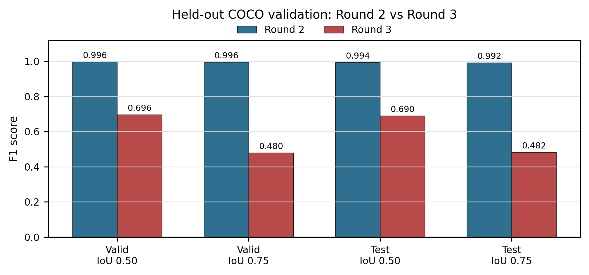
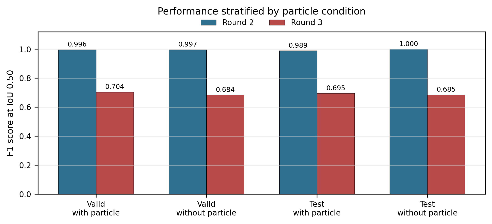
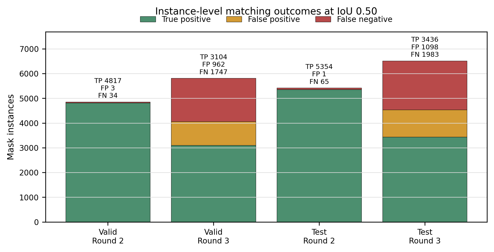

# BubMask-Fiji

Publication-stage research and development report  
Project: BubMask-Fiji, ML-driven microbubble size measurement for mineral engineering  
Institutional context: UNSW School of Mining and Mineral Engineering  
Current report date: 2026-06-01  
Archived development journal: `docs/archive/bubmask-fiji_old_version.md`  
Current operational Fiji script: `src/main/fiji/BubMask.py`  
Current installed script hash: `97DDF43E3A2A2E884962C7099177504E6B56667F6606326910DFB70D3FEC3882`

---

## Abstract

BubMask-Fiji is a Fiji/ImageJ-based research prototype for microbubble instance segmentation and bubble-size analysis in mineral-processing microscope images. The project adapts the BubMask Mask R-CNN workflow into a scientist-facing Fiji environment, adds calibration-aware measurement, produces traceable overlays and tabular outputs, and supports manual correction of missed bubbles using Fiji ROI tools. The development goal was not only to run a neural network, but to convert segmentation outputs into auditable mineral-engineering measurements: per-bubble equivalent diameter, histogram distributions, Sauter mean diameter, overlay images, instance-label masks, and exportable data packages.

The completed prototype provides a local Fiji menu entry, model selection between Original BubMask, UNSW Round 2, and UNSW Round 3 packages, a default calibration prompt of 183 px/mm, Mask R-CNN inference through a Python worker, manual bubble addition through a separate overlay review image, interactive histogram analysis, output-file retention control, and documented validation. Held-out COCO validation showed that the Round 2 package was substantially stronger than the Round 3 fine-tune on the available validation/test masks; therefore, Round 3 remains provisional and should not be claimed as scientifically more accurate without further independent validation.

---

## Table of Contents

1. [Project Purpose](#1-project-purpose)
2. [Research Objectives](#2-research-objectives)
3. [Scientific and Engineering Requirements](#3-scientific-and-engineering-requirements)
4. [System Architecture](#4-system-architecture)
5. [Data and Model Packages](#5-data-and-model-packages)
6. [Fiji User Workflow](#6-fiji-user-workflow)
7. [Measurement and Histogram Methodology](#7-measurement-and-histogram-methodology)
8. [Manual Bubble Review and Correction](#8-manual-bubble-review-and-correction)
9. [Validation and Model Comparison](#9-validation-and-model-comparison)
10. [Outputs, Traceability, and Reproducibility](#10-outputs-traceability-and-reproducibility)
11. [Repository Structure](#11-repository-structure)
12. [Limitations and Scientific Interpretation](#12-limitations-and-scientific-interpretation)
13. [Publication Figures and Screenshot Checklist](#13-publication-figures-and-screenshot-checklist)
14. [Future Work](#14-future-work)
15. [References and Supporting Documents](#15-references-and-supporting-documents)

---

## 1. Project Purpose

Microbubble sizing is important in mineral-processing experiments because bubble size distributions influence gas dispersion, flotation hydrodynamics, particle-bubble collision probability, and interpretation of operating conditions such as pressure, flow rate, and vent geometry. Manual bubble measurement is slow and inconsistent, while conventional thresholding can struggle with blurred bubbles, highlights, dense fields, uneven illumination, and non-bubble particles.

BubMask-Fiji was developed to provide a practical bridge between deep-learning segmentation and laboratory measurement. The intended user is a mineral scientist, not a machine-learning engineer. The interface therefore has to hide most runtime complexity while preserving enough metadata, outputs, and warnings for scientific audit.

The project started as a development journal and prototype scaffold. The original long-form journal has now been archived at:

```text
docs/archive/bubmask-fiji_old_version.md
```

This report is the curated publication-stage replacement. It keeps the scientific and engineering substance but removes the chronological noise of the development log.

---

## 2. Research Objectives

The completed research prototype pursued four linked objectives.

1. Integrate BubMask-style Mask R-CNN segmentation with Fiji/ImageJ so laboratory users can run analysis from the familiar Fiji environment.
2. Convert segmentation masks into scientifically meaningful microbubble measurements, including equivalent diameter and histogram outputs.
3. Preserve traceability through request/response JSON, overlay images, instance-label masks, logs, model metadata, and user-selected output packages.
4. Support manual scientific review, because model output alone is not sufficient for publication-grade bubble-size analysis.

The operational milestone is complete as of 2026-06-01. The live local Fiji entry is:

```text
Plugins > UNSW > BubMask
```

The source copy of the active Fiji script is:

```text
src/main/fiji/BubMask.py
```

The installed live copy is:

```text
C:\\Users\\arman\\Downloads\\fiji-latest-win64-jdk\\Fiji\\scripts\\Plugins\\UNSW\\BubMask.py
```

All current copies match SHA256:

```text
97DDF43E3A2A2E884962C7099177504E6B56667F6606326910DFB70D3FEC3882
```

---

## 3. Scientific and Engineering Requirements

### 3.1 Scientific Requirements

The tool must report measurement provenance as clearly as it reports numeric values. For bubble sizing, the essential requirements are:

- Use instance segmentation rather than only bounding boxes.
- Preserve per-bubble identity.
- Record equivalent diameter from measured mask area.
- Distinguish calibrated physical measurements from pixel-only exploratory measurements.
- Record model package, threshold, preprocessing profile, and calibration source.
- Produce visual overlays that can be reviewed by the user.
- Allow missed bubbles to be added manually before final histogram export.
- Export per-bubble data and histograms in forms usable for mineral-engineering analysis.

### 3.2 Calibration Policy

Calibration is treated as a scientific boundary. Physical diameters, areas, and Sauter mean diameter are only trustworthy when pixel size is known. BubMask-Fiji supports:

- embedded Fiji/ImageJ calibration from the active `ImagePlus`;
- user-set Fiji calibration before running BubMask;
- manual px/mm entry in the BubMask settings window.

The current default manual calibration is:

```text
183 px/mm
```

If the user supplies no calibration and Fiji metadata are pixel-only, BubMask can still perform segmentation and report pixel measurements, but physical measurements should not be treated as scientifically valid.

### 3.3 Engineering Requirements

The prototype was required to remain practical on the current Windows/Fiji development machine. The architecture therefore uses:

- Fiji/Jython for the active local UI prototype;
- a Python worker for Mask R-CNN inference and data processing;
- a JSON boundary between UI/request metadata and worker output;
- local run folders for traceability;
- versioned model packages under `models/`;
- separated source, validation, smoke-test, and artifact folders for open-source readiness.

---

## 4. System Architecture

### 4.1 High-Level Runtime Flow

```text
Open TIFF in Fiji
  -> Plugins > UNSW > BubMask
  -> choose model, confidence, calibration, and advanced options
  -> write request JSON and image input
  -> run Python worker
  -> load model package and perform Mask R-CNN inference
  -> write response JSON, masks, overlays, measurements, histograms
  -> open overlay review image
  -> allow manual ROI additions
  -> refresh histogram and statistics interactively
  -> finish processing
  -> choose retained/exported output package
```

### 4.2 Main Components

| Layer | Current implementation | Role |
|---|---|---|
| Fiji UI prototype | `src/main/fiji/BubMask.py` | Operational menu command and user workflow. |
| Python worker | `src/main/python/bubmask_worker.py` | Model loading, inference, measurement, artifacts. |
| Histogram tools | `src/main/python/bubmask_fiji/histogram/` | Per-image and interactive histogram export. |
| Excel export | `src/main/python/bubmask_fiji/export/` | Converts bubble CSV tables to Excel. |
| Java/SciJava scaffold | `src/main/java/` | Future production plugin foundation. |
| Model packages | `models/` | Versioned weights and metadata. |
| Validation assets | `validation/` | Datasets, evaluations, smoke tests, logs. |
| Documentation | `docs/` | Reports, plans, reference contracts, handoff memory. |

### 4.3 JSON Boundary

The Fiji UI writes a request JSON containing image path, model package, calibration, preprocessing, thresholds, and output directory. The worker writes a response JSON containing status, masks, measurements, diagnostics, and output paths. The stable contract is documented in:

```text
docs/reference/json_contract.md
```

This boundary makes the project easier to harden later because the Java/SciJava production plugin can call the same worker contract used by the Jython research prototype.

---

## 5. Data and Model Packages

### 5.1 Input Data

The primary accepted input is microscope TIFF imagery, ideally calibrated and retaining acquisition metadata. Real image intake is stored locally under:

```text
validation/real_tiff_samples/
```

The development inventory includes with-particle and without-particle image groups. The project also produced active-learning exports and COCO segmentation datasets for training/validation.

### 5.2 Model Packages

The Fiji prototype exposes these model choices:

```text
Original BubMask Mask R-CNN
UNSW Round 2 fine-tune (provisional)
UNSW Round 3 fine-tune (provisional)
```

Local model packages are under:

```text
models/bubmask-maskrcnn-v1
models/bubmask-maskrcnn-unsw-round2-v1
models/bubmask-maskrcnn-unsw-round3-v1
```

Large `.h5` weights are intentionally ignored by git. Model metadata and README files remain in the tree so the package structure is documented even when weights are distributed separately.

### 5.3 Round 3 Training Context

Round 3 was trained from a 350-image COCO segmentation export assembled after active-learning/autolabelling and human correction. The intended purpose was to improve model performance on UNSW microscope images, including with-particle and without-particle conditions.

However, later held-out validation found that Round 3 did not improve the measured instance-segmentation metrics relative to Round 2 on the available validation/test masks. This is a crucial scientific result, not a failed engineering result: the system successfully supports model comparison and prevents unsupported accuracy claims.

---

## 6. Fiji User Workflow

### 6.1 Current User Path

The current operational workflow is:

```text
Open TIFF in Fiji
  -> Plugins > UNSW > BubMask
  -> choose model and calibration/settings
  -> run Mask R-CNN worker
  -> inspect separate overlay image
  -> optionally draw Fiji ROIs for missed bubbles
  -> add current ROI or ROI Manager ROIs
  -> refresh mask overlay
  -> edit/review bubble table
  -> adjust histogram settings
  -> press OK to refresh histogram/statistics
  -> optionally CHANGE MODEL and rerun
  -> FINISH PROCESSING
  -> choose output files to keep/export
```

### 6.2 Settings Window

The settings window is simplified for normal use and hides advanced processing options behind `More options`. Core choices include:

- bubble detection method;
- model package;
- confidence threshold;
- calibration in px/mm, defaulting to 183 px/mm.

Advanced options include overlay mode, preprocessing profile, quality gate mode, processing previews, focus/diameter filters, optional background image, background correction mode, and background offset.

### 6.3 Review and Analysis Windows

The review workflow uses two processing windows:

1. `BubMask Overlay Review - draw Fiji ROI here`: a real Fiji image window where the user can draw ROI annotations using Fiji tools.
2. `BubMask Review and Analysis`: a tabbed control window for manual bubble addition, histogram analysis, bubble table review, statistics, run summary, and log.

The active buttons are:

| Button | Function |
|---|---|
| BACK | Move to previous review tab. |
| NEXT | Move to next review tab. |
| OK | Apply/refresh the current processing tab. In histogram analysis, this regenerates the graph/statistics. |
| CHANGE MODEL | Return to model/settings selection and rerun inference. |
| FINISH PROCESSING | Finalize analysis and show output-file selection. |
| CANCEL | Stop the run. |

Output-file selection is delayed until `FINISH PROCESSING` so the user can adjust manual bubbles and histograms before deciding what to save.

---

## 7. Measurement and Histogram Methodology

### 7.1 Per-Bubble Measurements

Each bubble instance is measured from its mask. The primary size descriptor is equivalent diameter, computed from mask area as the diameter of a circle with the same area:

```text
d_eq = 2 * sqrt(area / pi)
```

When calibration is trusted, area and diameter are converted into physical units. When calibration is missing, the same calculation is reported in pixel units and should be treated as exploratory.

Per-bubble records include ID, score, area, equivalent diameter, unit, centroid, bounding box fields, acceptance flags, calibration status, and quality flags.

### 7.2 Histograms

The worker and interactive analysis tools produce bubble diameter distributions. Standard run outputs include:

```text
diameter_histogram_all.csv
diameter_histogram_all.png
diameter_histogram_accepted.csv
diameter_histogram_accepted.png
diameter_histogram_raw_vs_reconstructed.csv
diameter_histogram_raw_vs_reconstructed.png
diameter_histogram_summary.json
```

The interactive histogram tab supports:

- count, fraction, or probability-density histogram mode;
- editable bin count;
- x-axis limits;
- PDF and CDF options;
- D32 / Sauter mean marker;
- mean diameter marker;
- D23 marker;
- editable bubble table before export.

Sauter mean diameter is computed as:

```text
D32 = sum(diameter^3) / sum(diameter^2)
```

D32 is scientifically meaningful only when diameter units are calibrated and consistent.

### 7.3 Raw-vs-Reconstructed Policy

Overlapping-bubble reconstruction was deliberately skipped for the completed research prototype. Raw-vs-reconstructed histogram files may still be emitted for schema stability, but reconstructed diameters are currently equivalent to raw mask equivalent diameters. Any publication text should avoid implying that overlap reconstruction is solved.

---

## 8. Manual Bubble Review and Correction

Model predictions are treated as candidate measurements. The user can add missed bubbles manually through Fiji ROI tools:

1. Draw an ROI around a missed bubble in the overlay review image.
2. Press `Add current ROI` or import multiple ROIs through ROI Manager.
3. Press `Refresh mask overlay` to update the overlay image.
4. Review the combined bubble table.
5. Refresh the histogram before final export.

Manual additions are not separated as a different scientific object class in the final histogram. They become bubbles in the combined measurement set. The output package records manual-bubble artifacts so the correction process remains traceable.

---

## 9. Validation and Model Comparison

### 9.1 Held-Out Evaluation Design

The final quantitative validation compared Round 2 and Round 3 on the cleaned Round 3 COCO segmentation dataset. The held-out evaluation used:

- validation split: 52 images;
- test split: 53 images;
- stratification by `with_particle` and `without_particle` images;
- instance-mask matching at IoU@0.50 and IoU@0.75.

Evaluation outputs are stored in:

```text
validation/evaluations/coco_eval_round3_human350_full_valid_test_final_20260529
```

The full validation report is:

```text
docs/reports/round3_heldout_validation_analysis_2026-05-29.md
```

### 9.2 Overall Results

| Split | Model | Images | GT masks | Predictions | Precision@0.50 | Recall@0.50 | F1@0.50 | Precision@0.75 | Recall@0.75 | F1@0.75 |
|---|---|---:|---:|---:|---:|---:|---:|---:|---:|---:|
| valid | Round 2 | 52 | 4851 | 4820 | 0.9994 | 0.9930 | 0.9962 | 0.9988 | 0.9924 | 0.9956 |
| valid | Round 3 | 52 | 4851 | 4066 | 0.7634 | 0.6399 | 0.6962 | 0.5261 | 0.4409 | 0.4798 |
| test | Round 2 | 53 | 5419 | 5355 | 0.9998 | 0.9880 | 0.9939 | 0.9981 | 0.9863 | 0.9922 |
| test | Round 3 | 53 | 5419 | 4534 | 0.7578 | 0.6341 | 0.6904 | 0.5287 | 0.4423 | 0.4817 |



### 9.3 Particle-Stratified Results

| Split | Condition | Model | Images | GT masks | Predictions | F1@0.50 | F1@0.75 |
|---|---|---|---:|---:|---:|---:|---:|
| valid | with_particle | Round 2 | 38 | 3010 | 2988 | 0.9960 | 0.9960 |
| valid | with_particle | Round 3 | 38 | 3010 | 2502 | 0.7036 | 0.4739 |
| valid | without_particle | Round 2 | 14 | 1841 | 1832 | 0.9965 | 0.9948 |
| valid | without_particle | Round 3 | 14 | 1841 | 1564 | 0.6843 | 0.4893 |
| test | with_particle | Round 2 | 35 | 2927 | 2864 | 0.9888 | 0.9877 |
| test | with_particle | Round 3 | 35 | 2927 | 2436 | 0.6951 | 0.4691 |
| test | without_particle | Round 2 | 18 | 2492 | 2491 | 0.9998 | 0.9974 |
| test | without_particle | Round 3 | 18 | 2492 | 2098 | 0.6850 | 0.4963 |



### 9.4 Error Composition

At IoU@0.50, Round 3 generated many more false negatives and false positives than Round 2:

| Split | Model | False negatives | False positives |
|---|---|---:|---:|
| valid | Round 2 | 34 | 3 |
| valid | Round 3 | 1747 | 962 |
| test | Round 2 | 65 | 1 |
| test | Round 3 | 1983 | 1098 |



### 9.5 Interpretation

The validation result is scientifically important: Round 3 should not be described as more accurate than Round 2. Round 3 is installed for side-by-side visual testing and UI development, but current held-out metrics support Round 2 as the stronger quantitative reference model for the available COCO labels.

This conclusion has one caveat. The COCO labels may be partly biased toward Round 2 if active-learning labels were initialized from Round 2 predictions. Therefore, the evaluation is strong enough to reject an unsupported Round 3 superiority claim, but it is not a fully independent proof that Round 2 is the final optimum for every future manually corrected dataset.

---

## 10. Outputs, Traceability, and Reproducibility

### 10.1 Runtime Outputs

Each run can produce:

- request JSON;
- response JSON;
- worker stdout/stderr logs;
- per-bubble CSV;
- Excel bubble table;
- box overlay PNG/TIFF;
- mask overlay PNG/TIFF;
- instance-label mask TIFF;
- histogram PNG/CSV;
- histogram statistics and summary JSON;
- manual-bubble combined outputs when applicable.

### 10.2 User-Selected Retention

At the end of processing, the user chooses whether to keep recommended outputs, select individual outputs, or discard result files. This prevents uncontrolled file clutter while still supporting full audit packages when needed.

### 10.3 Reproducibility Anchors

Key reproducibility anchors are:

```text
src/main/fiji/BubMask.py
src/main/python/bubmask_worker.py
docs/reference/json_contract.md
models/*/model.yaml
docs/reports/round3_heldout_validation_analysis_2026-05-29.md
validation/evaluations/coco_eval_round3_human350_full_valid_test_final_20260529
```

The current source/installed Fiji script hash is:

```text
97DDF43E3A2A2E884962C7099177504E6B56667F6606326910DFB70D3FEC3882
```

---

## 11. Repository Structure

The project tree was tidied for open-source readability on 2026-06-01.

```text
src/main/fiji/       Current Fiji/Jython research prototype script.
src/main/python/     Python worker, measurement, histogram, and export code.
src/main/java/       Java/SciJava plugin scaffold for future production work.
models/              Versioned model packages and metadata.
docs/                Source-of-truth report, references, plans, and figures.
validation/          Datasets, evaluation outputs, smoke tests, fixtures, logs.
results/             New local Fiji run outputs.
training_runs/       New local model-training outputs.
artifacts/           Local archived generated outputs from development.
```

The old chronological development report is preserved at:

```text
docs/archive/bubmask-fiji_old_version.md
```

Generated development outputs were moved to:

```text
artifacts/results_archive_20260601
artifacts/training_runs_archive_20260601
```

One result folder may remain in `results/` if a file is open in the IDE or operating system.

---

## 12. Limitations and Scientific Interpretation

The completed prototype is a research tool, not yet a polished public Fiji update-site plugin. Important limitations are:

- Round 3 is provisional and did not outperform Round 2 in the current held-out validation.
- Manual correction is supported, but inter-operator repeatability has not yet been quantified.
- Overlapping-bubble reconstruction is intentionally not implemented in the final research prototype.
- Calibration must be checked before reporting physical units.
- Large datasets, model weights, and generated artifacts are local and not suitable for direct git publication.
- The operational UI is a Fiji/Jython prototype; a production Java/SciJava plugin remains future work.

Scientifically, the safest claim is that BubMask-Fiji provides a traceable workflow for segmentation-assisted bubble measurement, with user review and calibrated histogram export. It should not be presented as a fully autonomous measurement instrument until independent validation and user repeatability studies are completed.

---

## 13. Publication Figures and Screenshot Checklist

The validation figures already available are:

- `docs/figures/round3_validation/overall_f1_round2_vs_round3.png`
- `docs/figures/round3_validation/condition_f1_iou50.png`
- `docs/figures/round3_validation/iou50_error_composition.png`
- `docs/figures/round3_validation/precision_recall_iou50.png`

Recommended UI screenshots still needed for a publication-stage report:

1. Fiji menu entry: `Plugins > UNSW > BubMask`.
2. BubMask settings/model-selection window showing Original, Round 2, and Round 3 model choices.
3. Overlay review image window with mask overlay and Fiji ROI drawn around a missed bubble.
4. BubMask Review and Analysis window on the Manual Bubbles tab.
5. Histogram tab after changing bin number and pressing `OK`.
6. Output-file selection prompt after `FINISH PROCESSING`.
7. Example output folder showing histogram CSV/PNG, Excel bubble table, overlay image, and instance-label mask.

Suggested storage location:

```text
docs/figures/ui/
```

Suggested filenames:

```text
fig_ui_01_fiji_menu_entry.png
fig_ui_02_settings_model_selection.png
fig_ui_03_overlay_review_manual_roi.png
fig_ui_04_manual_bubbles_tab.png
fig_ui_05_interactive_histogram_ok_refresh.png
fig_ui_06_output_file_selection.png
fig_ui_07_output_folder_package.png
```

---

## 14. Future Work

Production hardening should focus on:

- packaging the workflow as a polished Java/SciJava plugin or Fiji update-site package;
- improving installation for non-programmers;
- deciding whether Round 2 or a future retrained model should be the default production model;
- collecting independent fully human-corrected validation masks;
- quantifying manual-review repeatability between users;
- adding formal help/about/citation UI;
- documenting model-card metadata for each released model package;
- adding automated tests around JSON contracts, histogram export, calibration conversion, and output retention.

---

## 15. References and Supporting Documents

Primary project documents:

- User guide: `docs/user_guide.md`
- Local-only archived development journal: `docs/archive/bubmask-fiji_old_version.md`
- Local-only agent handoff memory: `docs/development/agent_handoff_memory.md`
- Round 3 validation report: `docs/reports/round3_heldout_validation_analysis_2026-05-29.md`
- UI feature report: `docs/reports/ui_feature_explanation_report.md`
- JSON worker contract: `docs/reference/json_contract.md`
- Next steps and roadmap: `docs/plans/next_steps.md`

Evidence inventory for publication-stage traceability:

| Evidence type | Repository location | Use in report |
| --- | --- | --- |
| Installed Fiji command | `src/main/fiji/BubMask.py` | Defines the current user workflow and UI behaviour |
| Validation figures | `docs/figures/round3_validation/` | Supports Round 2 vs Round 3 comparison |
| UI screenshots to add | `docs/figures/ui/` | Needed for final illustrated report/manuscript |
| Validation report | `docs/reports/round3_heldout_validation_analysis_2026-05-29.md` | Detailed held-out model comparison |
| UI feature report | `docs/reports/ui_feature_explanation_report.md` | Details manual review, histogram, and output-selection workflow |
| Model packages | `models/` | Defines deployable model choices and model metadata |
| Runtime output examples | `results/` and `artifacts/results_archive_20260601/` | Demonstrates generated histogram/table/overlay files |
| Active-learning materials | `validation/active_learning_round3/` | Documents Round 3 training-data development history |

External references used during project planning and reporting. Final manuscript
citations should be checked against publisher metadata before submission:

1. ImageJ/Fiji project: https://imagej.net/software/fiji/
2. DeepImageJ website: https://deepimagej.github.io/
3. DeepImageJ plugin repository: https://github.com/deepimagej/deepimagej-plugin
4. BioImage Model Zoo specification: https://github.com/bioimage-io/spec-bioimage-io
5. BubMask original repository: https://github.com/ywflow/BubMask
6. Kim and Park, "Deep learning-based automated and universal bubble detection and mask extraction in complex two-phase flows", Scientific Reports, 2021.
7. Cui et al., "A deep learning-based image processing method for bubble detection, segmentation, and shape reconstruction in high gas holdup sub-millimeter bubbly flows", Chemical Engineering Journal, 2022.
8. Zhang et al., "Machine learning-aided characterization of microbubbles for venturi bubble generator", Chemical Engineering Journal, 2023.
9. Xu et al., "BubSAM: Bubble segmentation and shape reconstruction based on Segment Anything Model of bubbly flow", AIChE Journal, 2024.
10. OpenCV adaptive thresholding, denoising, and CLAHE documentation.
11. scikit-image measure and region-properties documentation.
