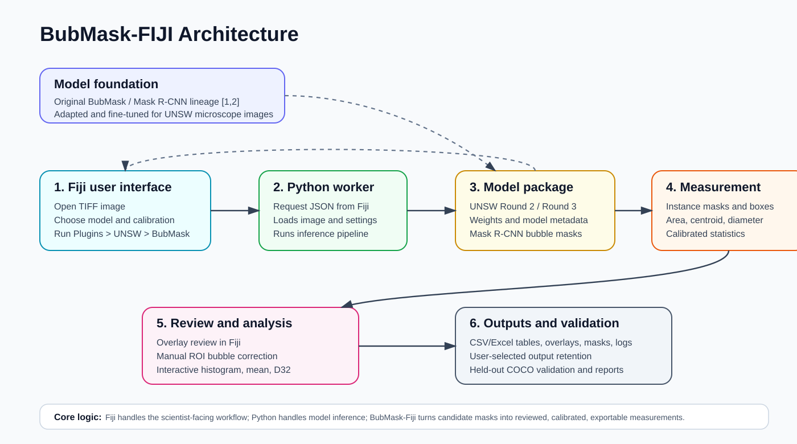

# BubMask-Fiji

- Researcher/Author: Armansyah Putra Marpaung, School of Electrical Engineering and Telecommunications, University of New South Wales
- Supervisor: Prof. Seher Ata, School of Minerals and Energy Resources Engineering, University of New South Wales
- Archived development journal: `docs/archive/bubmask-fiji_old_version.md`
- User guide available: `docs/user_guide.md`
- Current operational Fiji script: `src/main/fiji/BubMask.py`
- Current installed script hash: `97DDF43E3A2A2E884962C7099177504E6B56667F6606326910DFB70D3FEC3882`

---

## Abstract

BubMask-Fiji is a prototype for analysing the size of bubbles and the particular way in which each of them looks in images of mineral-processing microscopes. It is built on the Fiji/ImageJ software package and uses a Mask R-CNN workflow to allow scientists to obtain calibrated measurements for size and location of bubbles in order to generate traceable overlays, tabular outputs, and support for manual intervention with failed/dropped bubbles using Fiji's ROI tools. The project is explicitly based on the original BubMask work by Kim and Park, "Deep learning-based automated and universal bubble detection and mask extraction in complex two-phase flows", and the public BubMask repository at `https://github.com/ywflow/BubMask` [1]. The purpose of BubMask-Fiji was therefore not to claim a new neural-network architecture, but to adapt, retrain, and operationalise the BubMask-style model for UNSW mineral-processing microscope images and to convert the resulting masks into auditable mineral-engineering measurements.

The prototype has been completed and includes several features that allow users to access different model packages from their local Fiji environment. In particular, the user has access to a menu entry for BubMask, with options for selecting the BubMask Original metadata option, the UNSW Round 2 model, or the UNSW Round 3 model package. The user is prompted for the default calibration value of 183 px/mm, can perform Mask R-CNN inference using a Python worker, manually add bubbles though a separate overlay image for validation purposes, perform interactive analysis on bubble sizes, control retention of output files, and document the validation process. A companion user guide is available at `docs/user_guide.md` to support installation, Fiji navigation, manual bubble correction, histogram analysis, and troubleshooting. The held-out COCO validation showed that Round 2 remained stronger than Round 3 on the available validation/test masks; therefore, Round 3 is treated as a provisional user-interface default for testing rather than as a proven accuracy improvement.

---

## Introduction

Bubble size measurement is a recurring problem in mineral-processing experiments because gas dispersion, bubble-particle collision opportunity, and flotation hydrodynamics are all influenced by the distribution of bubble diameters in the pulp [25-27]. In laboratory imaging, however, the measurement task is not simply a matter of thresholding dark or bright objects. Microbubble images can contain uneven illumination, saturated highlights, blurred boundaries, dense bubble fields, field-of-view edge effects, and non-bubble particles [1,12,16,18,20]. A workflow that is useful to mineral scientists therefore has to combine automated detection with calibration, visual inspection, manual correction, and transparent data export [6,21,23,31].

Traditional image-analysis workflows in Fiji/ImageJ provide a strong environment for opening microscopy files, calibrating pixel scale, drawing regions of interest, and exporting measurement tables [3-5]. Their limitation in this project is that hand-tuned thresholding and classical morphology are brittle when bubbles vary in contrast, focus, and overlap [1,12,17,20]. Deep learning provides a stronger route for instance-level segmentation, but a model alone is not enough for scientific use [1,2,6,8,16]. The model output must be converted into per-bubble measurements, audit-friendly overlays, histograms, and reproducible output folders that a non-programmer can operate [6,21,28-31].

BubMask-Fiji was developed to bridge this gap. It packages a Mask R-CNN bubble-segmentation workflow behind a Fiji-accessible user interface, then connects the masks to calibrated equivalent diameter, Sauter mean diameter, per-bubble tables, histogram visualisation, and user-selected output retention. Its central scientific premise is conservative: neural-network masks are treated as candidate measurements that require review, not as automatically final truth. The completed research prototype is therefore best understood as a segmentation-assisted measurement workflow for mineral-engineering microscopy rather than a fully autonomous metrology instrument.

## Literature Review

### Fiji/ImageJ as the scientific user environment

ImageJ and Fiji are central to this project because they are not merely image viewers; they are established scientific image-analysis environments with support for microscopy files, calibration, regions of interest, overlays, measurement tables, macros, and plugins [3-5]. For mineral-processing researchers, this existing ecosystem matters because the user does not necessarily want to operate a separate computer-vision application. The practical requirement is to open a microscope image, confirm calibration, inspect regions of interest, and export measurements in the same environment already used for scientific image work.

The literature on ImageJ/Fiji and bioimage analysis therefore motivates the deployment strategy of BubMask-Fiji. The project follows the principle that a successful scientific machine-learning tool must integrate into the user's laboratory workflow, not only produce accurate masks in a standalone script [5-9,28-30]. DeepImageJ and BioImage.IO are particularly relevant precedents: they show that deep-learning models become usable to non-programmers only when model packaging, runtime dependencies, input/output definitions, examples, and documentation are treated as part of the scientific method [6,10]. BubMask-Fiji applies this lesson to a narrower mineral-engineering problem: bubble mask extraction and bubble-size measurement inside Fiji.

### Original BubMask as the model foundation

The most important technical foundation for this project is the original BubMask work by Kim and Park, "Deep learning-based automated and universal bubble detection and mask extraction in complex two-phase flows", together with the public GitHub repository `https://github.com/ywflow/BubMask` [1]. That work demonstrated that a Mask R-CNN-based approach can detect bubbles and extract masks across complex two-phase-flow images, building on the broader Mask R-CNN instance-segmentation architecture [1,2]. BubMask-Fiji builds directly from that contribution: the project does not claim to invent the original BubMask architecture. Instead, it adapts the BubMask model concept and codebase into a Fiji-accessible mineral-engineering workflow, then retrains/fine-tunes UNSW model packages so the detector is better matched to local microscope images, flow conditions, particles, highlights, and calibration requirements.

This provenance is scientifically important. The original BubMask paper establishes the feasibility of deep-learning-based bubble mask extraction [1]. BubMask-Fiji asks a different but complementary research question: how can that bubble-segmentation capability be converted into a usable, auditable, calibrated measurement tool for mineral scientists? The answer requires model adaptation, Fiji integration, user correction, output traceability, and validation against held-out segmentation masks [6,11]. In this sense, the contribution is translational and workflow-oriented: it takes an existing bubble-segmentation model family and develops the engineering and scientific measurement layer needed for routine laboratory use.

### From detection to measurement

The wider bubble-imaging literature shows why this distinction matters. Many bubble-recognition studies focus on detection accuracy, segmentation quality, or reconstruction in challenging multiphase images [12-18]. Cui et al. developed deep-learning image processing for bubble detection, segmentation, and shape reconstruction in high gas-holdup sub-millimetre bubbly flows [12]. Ruan et al. applied machine learning to microbubble characterisation for a venturi bubble generator [14]. Xu et al. proposed BubSAM for segmentation and shape reconstruction using the Segment Anything model [15]. Other work addresses multi-scale bubble detection, model comparison for microbubble segmentation, bubble dynamics in boiling, froth velocity, dry-bubble imaging, and computer-vision modelling of multiphase flows [13,16-20].

These studies support the conclusion that deep learning is a credible direction for difficult bubble images, but they also reveal a recurring gap: a segmentation result is not automatically a complete scientific measurement workflow [17,21]. Mineral-engineering bubble analysis requires calibrated diameter, Sauter mean diameter, histogram outputs, per-bubble records, visual overlays, manual review of missed/ambiguous bubbles, and reproducible export files [21-26]. BubMask-Fiji was built around that gap. Its measurement layer treats each mask as an object with area, equivalent diameter, centroid, status flags, calibration provenance, and exportable data.

### Validation and scientific caution

Mask R-CNN and COCO-style evaluation provide useful concepts for this project because each bubble is represented as an instance mask and model versions can be compared using IoU-based matching [2,11]. However, the literature and this project's validation results both show that segmentation metrics must be interpreted carefully. COCO agreement measures consistency with a particular annotation set; it does not by itself prove final scientific measurement accuracy across all future images, operators, or experimental conditions.

The Round 3 training process illustrates this point. A larger human-corrected COCO segmentation dataset was assembled and used for fine-tuning, but the held-out comparison showed that the Round 2 model remained closer to the current COCO labels than the Round 3 Fiji model. This is not a failure of the BubMask-Fiji workflow. Rather, it demonstrates why model versioning, validation splits, particle-stratified reporting, and conservative scientific claims are necessary. BubMask-Fiji therefore contributes not only a usable interface, but also a reproducible framework for deciding whether a new bubble model should be trusted.

### Contribution relative to the literature

BubMask-Fiji's contribution is intentionally application-facing. It does not present a new neural-network architecture. It contributes a domain-specific bridge between bubble-segmentation research and mineral-engineering laboratory practice:

- it adapts the original BubMask Mask R-CNN approach to UNSW microscope images [1,2];
- it packages Round 2 and Round 3 UNSW model variants as versioned model packages;
- it runs the workflow from Fiji through a Python worker rather than requiring users to run code manually;
- it converts masks into calibrated per-bubble measurements and histograms [21,26];
- it supports manual ROI correction before final export;
- it records output provenance through overlays, tables, masks, JSON summaries, and logs;
- it documents validation results and model limitations so the tool is not presented as more accurate than the evidence supports.

This positions BubMask-Fiji as a scientific software contribution: it advances the usability, reproducibility, and measurement traceability of deep-learning bubble analysis for mineral scientists.

## Research Development Trajectory

The project developed iteratively from literature review and image-format analysis into a public Fiji research prototype.

1. **Problem framing and image-format review.** Early work established that bubble-size measurement requires TIFF/OME-TIFF-aware scientific image handling, calibration metadata, and avoidance of lossy formats that can damage boundaries and highlights.
2. **Fiji and DeepImageJ design review.** The project then studied how scientific users interact with Fiji plugins and how DeepImageJ/BioImage.IO lower the barrier for deep-learning models [3,6,10]. This shifted the goal from "run a neural network" to "build a scientist-facing workflow".
3. **First Fiji-to-Python prototype.** The May 13 progress report demonstrated an end-to-end path from active Fiji image to Python worker, Mask R-CNN inference, JSON response, ResultsTable, and overlay.
4. **Measurement and audit outputs.** By May 20, the prototype had moved from bounding boxes to instance-mask overlays, calibrated measurement policy, quality flags, histogram/export artifacts, and validation scaffolding.
5. **Round 3 active-learning and training phase.** The project imported a 350-image COCO segmentation dataset with 34,258 bubble masks, cleaned the annotations, split train/validation/test data, and fine-tuned from the UNSW Round 2 model.
6. **Held-out validation and scientific restraint.** Final validation showed that Round 2 remained stronger than Round 3 against the available COCO labels, leading to the current conservative model-status language.
7. **Public release preparation.** The final stage focused on Fiji usability, manual bubble correction, histogram interaction, output selection, installer documentation, GitHub release packaging, and user-facing guides.

This trajectory explains the final structure of the project: BubMask-Fiji is not only a trained model, but a complete research workflow spanning image intake, model adaptation, user interaction, measurement, validation, documentation, and public deployment.

---

## Table of Contents

1. [Introduction](#introduction)
2. [Literature Review](#literature-review)
3. [Research Development Trajectory](#research-development-trajectory)
4. [Project Purpose](#1-project-purpose)
5. [Research Objectives](#2-research-objectives)
6. [Scientific and Engineering Requirements](#3-scientific-and-engineering-requirements)
7. [System Architecture](#4-system-architecture)
8. [Data and Model Packages](#5-data-and-model-packages)
9. [Fiji User Workflow](#6-fiji-user-workflow)
10. [Measurement and Histogram Methodology](#7-measurement-and-histogram-methodology)
11. [Manual Bubble Review and Correction](#8-manual-bubble-review-and-correction)
12. [Validation and Model Comparison](#9-validation-and-model-comparison)
13. [Outputs, Traceability, and Reproducibility](#10-outputs-traceability-and-reproducibility)
14. [Repository Structure](#11-repository-structure)
15. [Limitations and Scientific Interpretation](#12-limitations-and-scientific-interpretation)
16. [Publication Figures and Screenshot Checklist](#13-publication-figures-and-screenshot-checklist)
17. [Future Work](#14-future-work)
18. [References and Supporting Documents](#15-references-and-supporting-documents)

---

## 1. Project Purpose

Microbubble sizing is important in mineral-processing experiments because bubble size distributions influence gas dispersion, flotation hydrodynamics, particle-bubble collision probability, and interpretation of operating conditions such as pressure, flow rate, and vent geometry [25-27]. Manual bubble measurement is slow and inconsistent, while conventional thresholding can struggle with blurred bubbles, highlights, dense fields, uneven illumination, and non-bubble particles [1,12,17,20,21,23].

BubMask-Fiji was developed to provide a practical bridge between deep-learning segmentation and laboratory measurement. The intended user is a mineral scientist, not a machine-learning engineer. The interface therefore has to hide most runtime complexity while preserving enough metadata, outputs, and warnings for scientific audit.

The project started as a development journal and prototype scaffold. The original long-form journal has now been archived at:

```text
docs/archive/bubmask-fiji_old_version.md
```

This report is the curated publication-stage replacement. It keeps the scientific and engineering substance but removes the chronological noise of the development log.

---

## 2. Research Objectives

The completed research prototype pursued four linked objectives.

1. Integrate BubMask-style Mask R-CNN segmentation with Fiji/ImageJ so laboratory users can run analysis from the familiar Fiji environment.
2. Convert segmentation masks into scientifically meaningful microbubble measurements, including equivalent diameter and histogram outputs.
3. Preserve traceability through request/response JSON, overlay images, instance-label masks, logs, model metadata, and user-selected output packages.
4. Support manual scientific review, because model output alone is not sufficient for publication-grade bubble-size analysis.

The research goals evolved during the project. The initial goal was to connect an existing deep-learning bubble detector to Fiji; the final goal became broader: to produce a reproducible scientific measurement workflow that starts from a microscope image, adapts the original BubMask modelling approach to UNSW images, permits human correction, exports calibrated bubble-size statistics, and records enough provenance for later audit or publication.

The operational milestone is complete as of 2026-06-01. The live local Fiji entry is:

```text
Plugins > UNSW > BubMask
```

The source copy of the active Fiji script is:

```text
src/main/fiji/BubMask.py
```

The installed live copy is:

```text
C:\\Users\\arman\\Downloads\\fiji-latest-win64-jdk\\Fiji\\scripts\\Plugins\\UNSW\\BubMask.py
```

All current copies match SHA256:

```text
97DDF43E3A2A2E884962C7099177504E6B56667F6606326910DFB70D3FEC3882
```

---

## 3. Scientific and Engineering Requirements

### 3.1 Scientific Requirements

The tool must report measurement provenance as clearly as it reports numeric values. For bubble sizing, the essential requirements are:

- Use instance segmentation rather than only bounding boxes.
- Preserve per-bubble identity.
- Record equivalent diameter from measured mask area.
- Distinguish calibrated physical measurements from pixel-only exploratory measurements.
- Record model package, threshold, preprocessing profile, and calibration source.
- Produce visual overlays that can be reviewed by the user.
- Allow missed bubbles to be added manually before final histogram export.
- Export per-bubble data and histograms in forms usable for mineral-engineering analysis.

### 3.2 Calibration Policy

Calibration is treated as a scientific boundary. Physical diameters, areas, and Sauter mean diameter are only trustworthy when pixel size is known. BubMask-Fiji supports:

- embedded Fiji/ImageJ calibration from the active `ImagePlus`;
- user-set Fiji calibration before running BubMask;
- manual px/mm entry in the BubMask settings window.

The current default manual calibration is:

```text
183 px/mm
```

If the user supplies no calibration and Fiji metadata are pixel-only, BubMask can still perform segmentation and report pixel measurements, but physical measurements should not be treated as scientifically valid.

### 3.3 Engineering Requirements

The prototype was required to remain practical on the current Windows/Fiji development machine. The architecture therefore uses:

- Fiji/Jython for the active local UI prototype;
- a Python worker for Mask R-CNN inference and data processing;
- a JSON boundary between UI/request metadata and worker output;
- local run folders for traceability;
- versioned model packages under `models/`;
- separated source, validation, smoke-test, and artifact folders for open-source readiness.

---

## 4. System Architecture

The overall project can be understood as a workflow architecture rather than as a single model script. The most important components are the Fiji user interface, the Python worker, the model package, the mask-measurement layer, the manual review/histogram layer, and the output/validation layer.



Figure 1. BubMask-FIJI Architecture. The diagram shows the key project components that convert a microscope image into reviewed, calibrated bubble-size measurements: Fiji input/settings, Python inference, model packages, mask measurement, manual review with histogram analysis, and output/validation artifacts.

### 4.1 High-Level Runtime Flow

```text
Open TIFF in Fiji
  -> Plugins > UNSW > BubMask
  -> choose model, confidence, calibration, and advanced options
  -> write request JSON and image input
  -> run Python worker
  -> load model package and perform Mask R-CNN inference
  -> write response JSON, masks, overlays, measurements, histograms
  -> open overlay review image
  -> allow manual ROI additions
  -> refresh histogram and statistics interactively
  -> finish processing
  -> choose retained/exported output package
```

### 4.2 Main Components

| Layer | Current implementation | Role |
|---|---|---|
| Fiji UI prototype | `src/main/fiji/BubMask.py` | Operational menu command and user workflow. |
| Python worker | `src/main/python/bubmask_worker.py` | Model loading, inference, measurement, artifacts. |
| Histogram tools | `src/main/python/bubmask_fiji/histogram/` | Per-image and interactive histogram export. |
| Excel export | `src/main/python/bubmask_fiji/export/` | Converts bubble CSV tables to Excel. |
| Java/SciJava scaffold | `src/main/java/` | Future production plugin foundation. |
| Model packages | `models/` | Versioned weights and metadata. |
| Validation assets | `validation/` | Datasets, evaluations, smoke tests, logs. |
| Documentation | `docs/` | Reports, plans, reference contracts, handoff memory. |

### 4.3 JSON Boundary

The Fiji UI writes a request JSON containing image path, model package, calibration, preprocessing, thresholds, and output directory. The worker writes a response JSON containing status, masks, measurements, diagnostics, and output paths. The stable contract is documented in:

```text
docs/reference/json_contract.md
```

This boundary makes the project easier to harden later because the Java/SciJava production plugin can call the same worker contract used by the Jython research prototype.

---

## 5. Data and Model Packages

### 5.1 Input Data

The primary accepted input is microscope TIFF imagery, ideally calibrated and retaining acquisition metadata. Real image intake is stored locally under:

```text
validation/real_tiff_samples/
```

The development inventory includes with-particle and without-particle image groups. The project also produced active-learning exports and COCO segmentation datasets for training/validation.

### 5.2 Model Packages

The Fiji prototype exposes these model choices:

```text
Original BubMask Mask R-CNN
UNSW Round 2 fine-tune (provisional)
UNSW Round 3 fine-tune (provisional)
```

Local model packages are under:

```text
models/bubmask-maskrcnn-v1
models/bubmask-maskrcnn-unsw-round2-v1
models/bubmask-maskrcnn-unsw-round3-v1
```

Large `.h5` weights are intentionally ignored by git. Model metadata and README files remain in the tree so the package structure is documented even when weights are distributed separately.

### 5.3 Round 3 Training Context

Round 3 was trained from a 350-image COCO segmentation export assembled after active-learning/autolabelling and human correction. The intended purpose was to improve model performance on UNSW microscope images, including with-particle and without-particle conditions.

However, later held-out validation found that Round 3 did not improve the measured instance-segmentation metrics relative to Round 2 on the available validation/test masks. This is a crucial scientific result, not a failed engineering result: the system successfully supports model comparison and prevents unsupported accuracy claims.

---

## 6. Fiji User Workflow

### 6.1 Current User Path

The current operational workflow is:

```text
Open TIFF in Fiji
  -> Plugins > UNSW > BubMask
  -> choose model and calibration/settings
  -> run Mask R-CNN worker
  -> inspect separate overlay image
  -> optionally draw Fiji ROIs for missed bubbles
  -> add current ROI or ROI Manager ROIs
  -> refresh mask overlay
  -> edit/review bubble table
  -> adjust histogram settings
  -> press OK to refresh histogram/statistics
  -> optionally CHANGE MODEL and rerun
  -> FINISH PROCESSING
  -> choose output files to keep/export
```

### 6.2 Settings Window

The settings window is simplified for normal use and hides advanced processing options behind `More options`. Core choices include:

- bubble detection method;
- model package;
- confidence threshold;
- calibration in px/mm, defaulting to 183 px/mm.

Advanced options include overlay mode, preprocessing profile, quality gate mode, processing previews, focus/diameter filters, optional background image, background correction mode, and background offset.

### 6.3 Review and Analysis Windows

The review workflow uses two processing windows:

1. `BubMask Overlay Review - draw Fiji ROI here`: a real Fiji image window where the user can draw ROI annotations using Fiji tools.
2. `BubMask Review and Analysis`: a tabbed control window for manual bubble addition, histogram analysis, bubble table review, statistics, run summary, and log.

The active buttons are:

| Button | Function |
|---|---|
| BACK | Move to previous review tab. |
| NEXT | Move to next review tab. |
| OK | Apply/refresh the current processing tab. In histogram analysis, this regenerates the graph/statistics. |
| CHANGE MODEL | Return to model/settings selection and rerun inference. |
| FINISH PROCESSING | Finalize analysis and show output-file selection. |
| CANCEL | Stop the run. |

Output-file selection is delayed until `FINISH PROCESSING` so the user can adjust manual bubbles and histograms before deciding what to save.

---

## 7. Measurement and Histogram Methodology

### 7.1 Per-Bubble Measurements

Each bubble instance is measured from its mask. The primary size descriptor is equivalent diameter, computed from mask area as the diameter of a circle with the same area:

```text
d_eq = 2 * sqrt(area / pi)
```

When calibration is trusted, area and diameter are converted into physical units. When calibration is missing, the same calculation is reported in pixel units and should be treated as exploratory.

Per-bubble records include ID, score, area, equivalent diameter, unit, centroid, bounding box fields, acceptance flags, calibration status, and quality flags.

### 7.2 Histograms

The worker and interactive analysis tools produce bubble diameter distributions. Standard run outputs include:

```text
diameter_histogram_all.csv
diameter_histogram_all.png
diameter_histogram_accepted.csv
diameter_histogram_accepted.png
diameter_histogram_raw_vs_reconstructed.csv
diameter_histogram_raw_vs_reconstructed.png
diameter_histogram_summary.json
```

The interactive histogram tab supports:

- count, fraction, or probability-density histogram mode;
- editable bin count;
- x-axis limits;
- PDF and CDF options;
- D32 / Sauter mean marker;
- mean diameter marker;
- D23 marker;
- editable bubble table before export.

Sauter mean diameter is computed as:

```text
D32 = sum(diameter^3) / sum(diameter^2)
```

D32 is scientifically meaningful only when diameter units are calibrated and consistent.

### 7.3 Raw-vs-Reconstructed Policy

Overlapping-bubble reconstruction was deliberately skipped for the completed research prototype. Raw-vs-reconstructed histogram files may still be emitted for schema stability, but reconstructed diameters are currently equivalent to raw mask equivalent diameters. Any publication text should avoid implying that overlap reconstruction is solved.

---

## 8. Manual Bubble Review and Correction

Model predictions are treated as candidate measurements. The user can add missed bubbles manually through Fiji ROI tools:

1. Draw an ROI around a missed bubble in the overlay review image.
2. Press `Add current ROI` or import multiple ROIs through ROI Manager.
3. Press `Refresh mask overlay` to update the overlay image.
4. Review the combined bubble table.
5. Refresh the histogram before final export.

Manual additions are not separated as a different scientific object class in the final histogram. They become bubbles in the combined measurement set. The output package records manual-bubble artifacts so the correction process remains traceable.

---

## 9. Validation and Model Comparison

### 9.1 Held-Out Evaluation Design

The final quantitative validation compared Round 2 and Round 3 on the cleaned Round 3 COCO segmentation dataset. The held-out evaluation used:

- validation split: 52 images;
- test split: 53 images;
- stratification by `with_particle` and `without_particle` images;
- instance-mask matching at IoU@0.50 and IoU@0.75.

Evaluation outputs are stored in:

```text
validation/evaluations/coco_eval_round3_human350_full_valid_test_final_20260529
```

The full validation report is:

```text
docs/reports/round3_heldout_validation_analysis_2026-05-29.md
```

### 9.2 Overall Results

| Split | Model | Images | GT masks | Predictions | Precision@0.50 | Recall@0.50 | F1@0.50 | Precision@0.75 | Recall@0.75 | F1@0.75 |
|---|---|---:|---:|---:|---:|---:|---:|---:|---:|---:|
| valid | Round 2 | 52 | 4851 | 4820 | 0.9994 | 0.9930 | 0.9962 | 0.9988 | 0.9924 | 0.9956 |
| valid | Round 3 | 52 | 4851 | 4066 | 0.7634 | 0.6399 | 0.6962 | 0.5261 | 0.4409 | 0.4798 |
| test | Round 2 | 53 | 5419 | 5355 | 0.9998 | 0.9880 | 0.9939 | 0.9981 | 0.9863 | 0.9922 |
| test | Round 3 | 53 | 5419 | 4534 | 0.7578 | 0.6341 | 0.6904 | 0.5287 | 0.4423 | 0.4817 |


### 9.3 Particle-Stratified Results

| Split | Condition | Model | Images | GT masks | Predictions | F1@0.50 | F1@0.75 |
|---|---|---|---:|---:|---:|---:|---:|
| valid | with_particle | Round 2 | 38 | 3010 | 2988 | 0.9960 | 0.9960 |
| valid | with_particle | Round 3 | 38 | 3010 | 2502 | 0.7036 | 0.4739 |
| valid | without_particle | Round 2 | 14 | 1841 | 1832 | 0.9965 | 0.9948 |
| valid | without_particle | Round 3 | 14 | 1841 | 1564 | 0.6843 | 0.4893 |
| test | with_particle | Round 2 | 35 | 2927 | 2864 | 0.9888 | 0.9877 |
| test | with_particle | Round 3 | 35 | 2927 | 2436 | 0.6951 | 0.4691 |
| test | without_particle | Round 2 | 18 | 2492 | 2491 | 0.9998 | 0.9974 |
| test | without_particle | Round 3 | 18 | 2492 | 2098 | 0.6850 | 0.4963 |


### 9.4 Error Composition

At IoU@0.50, Round 3 generated many more false negatives and false positives than Round 2:

| Split | Model | False negatives | False positives |
|---|---|---:|---:|
| valid | Round 2 | 34 | 3 |
| valid | Round 3 | 1747 | 962 |
| test | Round 2 | 65 | 1 |
| test | Round 3 | 1983 | 1098 |


### 9.5 Interpretation

The validation result is scientifically important: Round 3 should not be described as more accurate than Round 2. Round 3 is installed for side-by-side visual testing and UI development, but current held-out metrics support Round 2 as the stronger quantitative reference model for the available COCO labels.

This conclusion has one caveat. The COCO labels may be partly biased toward Round 2 if active-learning labels were initialized from Round 2 predictions. Therefore, the evaluation is strong enough to reject an unsupported Round 3 superiority claim, but it is not a fully independent proof that Round 2 is the final optimum for every future manually corrected dataset.

---

## 10. Outputs, Traceability, and Reproducibility

### 10.1 Runtime Outputs

Each run can produce:

- request JSON;
- response JSON;
- worker stdout/stderr logs;
- per-bubble CSV;
- Excel bubble table;
- box overlay PNG/TIFF;
- mask overlay PNG/TIFF;
- instance-label mask TIFF;
- histogram PNG/CSV;
- histogram statistics and summary JSON;
- manual-bubble combined outputs when applicable.

### 10.2 User-Selected Retention

At the end of processing, the user chooses whether to keep recommended outputs, select individual outputs, or discard result files. This prevents uncontrolled file clutter while still supporting full audit packages when needed.

### 10.3 Reproducibility Anchors

Key reproducibility anchors are:

```text
src/main/fiji/BubMask.py
src/main/python/bubmask_worker.py
docs/reference/json_contract.md
models/*/model.yaml
docs/reports/round3_heldout_validation_analysis_2026-05-29.md
validation/evaluations/coco_eval_round3_human350_full_valid_test_final_20260529
```

The current source/installed Fiji script hash is:

```text
97DDF43E3A2A2E884962C7099177504E6B56667F6606326910DFB70D3FEC3882
```

---

## 11. Repository Structure

The project tree was tidied for open-source readability on 2026-06-01.

```text
src/main/fiji/       Current Fiji/Jython research prototype script.
src/main/python/     Python worker, measurement, histogram, and export code.
src/main/java/       Java/SciJava plugin scaffold for future production work.
models/              Versioned model packages and metadata.
docs/                Source-of-truth report, references, plans, and figures.
validation/          Datasets, evaluation outputs, smoke tests, fixtures, logs.
results/             New local Fiji run outputs.
training_runs/       New local model-training outputs.
artifacts/           Local archived generated outputs from development.
```

The old chronological development report is preserved at:

```text
docs/archive/bubmask-fiji_old_version.md
```

Generated development outputs were moved to:

```text
artifacts/results_archive_20260601
artifacts/training_runs_archive_20260601
```

One result folder may remain in `results/` if a file is open in the IDE or operating system.

---

## 12. Limitations and Scientific Interpretation

The completed prototype is a research tool, not yet a polished public Fiji update-site plugin. Important limitations are:

- Round 3 is provisional and did not outperform Round 2 in the current held-out validation.
- Manual correction is supported, but inter-operator repeatability has not yet been quantified.
- Overlapping-bubble reconstruction is intentionally not implemented in the final research prototype.
- Calibration must be checked before reporting physical units.
- Large datasets, model weights, and generated artifacts are local and not suitable for direct git publication.
- The operational UI is a Fiji/Jython prototype; a production Java/SciJava plugin remains future work.

Scientifically, the safest claim is that BubMask-Fiji provides a traceable workflow for segmentation-assisted bubble measurement, with user review and calibrated histogram export. It should not be presented as a fully autonomous measurement instrument until independent validation and user repeatability studies are completed.

---

## 13. Publication Figures and Screenshot Checklist

The architecture and validation figures already available are:

- `docs/figures/architecture/bubmask_fiji_workflow_architecture.svg`
- `docs/figures/round3_validation/overall_f1_round2_vs_round3.png`
- `docs/figures/round3_validation/condition_f1_iou50.png`
- `docs/figures/round3_validation/iou50_error_composition.png`
- `docs/figures/round3_validation/precision_recall_iou50.png`

Recommended UI screenshots still needed for a publication-stage report:

1. Fiji menu entry: `Plugins > UNSW > BubMask`.
2. BubMask settings/model-selection window showing Original, Round 2, and Round 3 model choices.
3. Overlay review image window with mask overlay and Fiji ROI drawn around a missed bubble.
4. BubMask Review and Analysis window on the Manual Bubbles tab.
5. Histogram tab after changing bin number and pressing `OK`.
6. Output-file selection prompt after `FINISH PROCESSING`.
7. Example output folder showing histogram CSV/PNG, Excel bubble table, overlay image, and instance-label mask.

Suggested storage location:

```text
docs/figures/ui/
```

Suggested filenames:

```text
fig_ui_01_fiji_menu_entry.png
fig_ui_02_settings_model_selection.png
fig_ui_03_overlay_review_manual_roi.png
fig_ui_04_manual_bubbles_tab.png
fig_ui_05_interactive_histogram_ok_refresh.png
fig_ui_06_output_file_selection.png
fig_ui_07_output_folder_package.png
```

---

## 14. Future Work

The next stage of BubMask-Fiji should focus on production hardening. The current Fiji/Jython script is suitable for rapid research iteration, but a public tool for non-programmer mineral scientists would be stronger as a polished Java/SciJava plugin or Fiji update-site package. This would allow the workflow to appear as a conventional Fiji command, reduce manual file-copy steps, and make installation less dependent on the user understanding Python environments, model-weight paths, and local project-folder configuration.

The scientific priority is to strengthen model governance and validation. The current results show that Round 2 performed better than Round 3 on the available held-out COCO masks, while Round 3 remains the current user-interface default for testing. Future work should therefore decide whether Round 2, Round 3, or a new retrained model should become the production default only after additional independent validation. This should include newly collected, fully human-corrected masks, image sets from different experimental sessions, and explicit tests on with-particle and without-particle images.

Manual review also needs formal evaluation. BubMask-Fiji deliberately includes Fiji ROI correction because segmentation outputs should be treated as candidate measurements rather than final truth. However, the reliability of manual correction should be quantified by repeatability studies between users. Such work would show whether two trained users produce similar corrected bubble counts, equivalent diameters, and Sauter mean diameters from the same image, and would clarify how much uncertainty the manual-review stage introduces into the final measurement.

The public release should also improve user support and citation transparency. A production version should include formal help, about, and citation interfaces inside Fiji, together with model-card metadata for every released model package. Each model card should record training data, annotation source, validation split, default threshold, intended image domain, known failure modes, and whether the model is recommended for scientific reporting or only for comparison/testing.

Finally, the software should be protected by automated tests around the most important scientific boundaries: JSON contracts between Fiji and Python, histogram export, calibration conversion, output-file retention, instance-mask export, and error handling when model weights or Python dependencies are missing. These tests would make the project safer to maintain as the interface moves from research prototype to open-source scientific software.

---

## 15. References and Supporting Documents

Primary project documents:

- User guide: `docs/user_guide.md`
- Local-only archived development journal: `docs/archive/bubmask-fiji_old_version.md`
- Local-only agent handoff memory: `docs/development/agent_handoff_memory.md`
- Round 3 validation report: `docs/reports/round3_heldout_validation_analysis_2026-05-29.md`
- UI feature report: `docs/reports/ui_feature_explanation_report.md`
- JSON worker contract: `docs/reference/json_contract.md`
- Next steps and roadmap: `docs/plans/next_steps.md`

Evidence inventory for publication-stage traceability:

| Evidence type | Repository location | Use in report |
| --- | --- | --- |
| Installed Fiji command | `src/main/fiji/BubMask.py` | Defines the current user workflow and UI behaviour |
| Validation figures | `docs/figures/round3_validation/` | Supports Round 2 vs Round 3 comparison |
| UI screenshots to add | `docs/figures/ui/` | Needed for final illustrated report/manuscript |
| Validation report | `docs/reports/round3_heldout_validation_analysis_2026-05-29.md` | Detailed held-out model comparison |
| UI feature report | `docs/reports/ui_feature_explanation_report.md` | Details manual review, histogram, and output-selection workflow |
| Model packages | `models/` | Defines deployable model choices and model metadata |
| Runtime output examples | `results/` and `artifacts/results_archive_20260601/` | Demonstrates generated histogram/table/overlay files |
| Active-learning materials | `validation/active_learning_round3/` | Documents Round 3 training-data development history |

### 15.1 References

[1] Kim, Y. and Park, J. (2021) "Deep learning-based automated and universal bubble detection and mask extraction in complex two-phase flows", Scientific Reports. Original BubMask code repository: `https://github.com/ywflow/BubMask`. Local PDF: `docs_reports/literature_review_weekly_updates/ML_for_Bubble_Size_Measurement_Papers/s41598-021-88334-0.pdf`.

[2] He, K., Gkioxari, G., Dollar, P. and Girshick, R. (2017) "Mask R-CNN", IEEE International Conference on Computer Vision.

[3] Schindelin, J. et al. (2012) "Fiji: an open-source platform for biological-image analysis", Nature Methods.

[4] Schneider, C. A., Rasband, W. S. and Eliceiri, K. W. (2012) "NIH Image to ImageJ: 25 years of image analysis", Nature Methods.

[5] Schroeder, A. B. et al. (2021) "The ImageJ ecosystem: Open-source software for image visualization, processing, and analysis", Protein Science.

[6] Gomez-de-Mariscal, E. et al. (2021) "DeepImageJ: A user-friendly environment to run deep learning models in ImageJ", Nature Methods.

[7] Berg, S. et al. (2019) "ilastik: interactive machine learning for (bio)image analysis", Nature Methods.

[8] Moen, E. et al. (2019) "Deep learning for cellular image analysis", Nature Methods.

[9] Jan, Z. et al. (2024) "From pixels to insights: Machine learning and deep learning for bioimage analysis", BioEssays.

[10] BioImage.IO Consortium (n.d.) "BioImage Model Zoo specification", available at `https://github.com/bioimage-io/spec-bioimage-io`.

[11] Lin, T.-Y. et al. (2014) "Microsoft COCO: Common Objects in Context", European Conference on Computer Vision.

[12] Cui, Y. et al. (2022) "A deep learning-based image processing method for bubble detection, segmentation, and shape reconstruction in high gas holdup sub-millimeter bubbly flows", Chemical Engineering Journal.

[13] Bai, L., Wang, X., Lin, S., Chai, Z. and Zhao, R. (2025) "Deep Learning-Based Multi-Scale Bubble Detection and Feature Analysis", Industrial & Engineering Chemistry Research.

[14] Ruan, J. et al. (2023) "Machine learning-aided characterization of microbubbles for venturi bubble generator", Chemical Engineering Journal.

[15] Xu, H. et al. (2024) "BubSAM: Bubble segmentation and shape reconstruction based on Segment Anything Model of bubbly flow", AIChE Journal.

[16] Ren, Y. et al. (2026) "A review of deep learning-based bubble recognition methods", Flow Measurement and Instrumentation.

[17] Cai, T. et al. (2025) "Balanced deep learning-based bubble segmentation: Model comparison, optimization, and application in microbubble detection", Flow Measurement and Instrumentation.

[18] Malakhov, I. et al. (2023) "Deep learning segmentation to analyze bubble dynamics and heat transfer during boiling at various pressures", International Journal of Multiphase Flow.

[19] Jahedsaravani, A. et al. (2023) "Measurement of bubble size and froth velocity using convolutional neural networks", Minerals Engineering.

[20] Nizovtseva, I. et al. (2024) "Bubble Detection in Multiphase Flows Through Computer Vision and Deep Learning for Applied Modeling", Mathematics.

[21] Mesa, D., Quintanilla, P. and Reyes, F. (2022) "Bubble Analyser - An open-source software for bubble size measurement using image analysis", Minerals Engineering.

[22] Bubble Analyser project documentation (n.d.) "Bubble Analyser Manual".

[23] Knupfer, L. and Heitkam, S. (2022) "A machine learning approach to determine bubble sizes in foam at a transparent wall", Measurement Science and Technology.

[24] Srisaeng, S. et al. (2023) "Machine Learning Models for Micro-bubble Image Detection in Mosquito Sprayer Quality Control: Addressing Class and Scale Imbalance".

[25] Wang, J., Forbes, G. and Forbes, E. (2022) "Bubble Size in Flotation", Applied Sciences.

[26] "Industrial application of microbubble generation: the state-of-the-art and perspectives". Local PDF: `docs_reports/literature_review_weekly_updates/ML_for_Bubble_Size_Measurement_Papers/PAPER 1 MINERAL ENG.pdf`.

[27] "An acoustic agglomeration method for separation/recovery of ultrafine particles by flotation". Local PDF: `docs_reports/literature_review_weekly_updates/ML_for_Bubble_Size_Measurement_Papers/PAPER 2 MINERAL ENG.pdf`.

[28] Dominguez, C. et al. (2017) "IJ-OpenCV: Combining ImageJ and OpenCV for processing images in biomedicine", Computers in Biology and Medicine.

[29] "Open-source deep-learning software for bioimage segmentation". Local PDF: `docs_reports/literature_review_weekly_updates/New_Lit_Review-ML-&_DL_for_bubble_size_measurement/open-source-deep-learning-software-for-bioimage-segmentation.pdf`.

[30] Vargas, M. K. et al. (2021) Science of the Total Environment image-analysis/machine-learning reference. Local PDF: `docs_reports/literature_review_weekly_updates/Integrating_ML_to_FIJI_ImageJ/1-s2.0-S0048969720362574-main.pdf`. Full bibliographic metadata should be verified before submission.

[31] OpenCV and scikit-image documentation (n.d.) image preprocessing, region properties, and measurement documentation.
