# BubMask-Fiji User Guide

Version: research prototype, 2026-06-02

BubMask-Fiji is a Fiji/ImageJ workflow for measuring microbubble size
distributions from microscope images. It combines Mask R-CNN bubble
segmentation with Fiji overlays, manual ROI correction, calibrated diameter
measurement, histogram analysis, and exportable result files.

This guide is written for mineral-engineering users who want to run the tool,
inspect the masks, correct missed bubbles, and export traceable outputs.

---

## 1. Before You Start

### Required Software

- Fiji/ImageJ.
- The BubMask Fiji script installed under `Plugins > UNSW > BubMask`.
- A local BubMask Python environment with the required Mask R-CNN dependencies.
- BubMask model package files stored under the local `models/` directory.

The currently tested local Fiji script is:

```text
src/main/fiji/BubMask.py
```

The live installed script should be copied to:

```text
Fiji/scripts/Plugins/UNSW/BubMask.py
```

### Input Images

Use microscope images in TIFF or another Fiji-readable image format. For
scientific reporting, record the experimental context for each image:

- flow rate;
- pressure;
- vent geometry;
- replicate number;
- calibration in pixels per millimetre;
- sample notes such as particles, blur, uneven illumination, or strong
  highlights.

### Calibration

BubMask-Fiji uses `183 px/mm` as the default calibration when no user value is
entered. Confirm this before using millimetre-scale measurements. If your image
has a different microscope calibration, enter the correct value in the settings
window.

---

## 2. Downloading from GitHub and Installing in Fiji

Public users can download the source release from GitHub:

```text
https://github.com/armansyahpm/bubmask-fiji
```

There are two common download options:

1. Use GitHub `Code > Download ZIP`, then extract the folder.
2. Use git:

```powershell
git clone https://github.com/armansyahpm/bubmask-fiji.git
```

The extracted or cloned folder is called the BubMask-Fiji project folder in this
guide.

### Recommended Windows Installer

From PowerShell in the downloaded `bubmask-fiji` folder:

```powershell
.\install_bubmask_fiji.ps1 -FijiPath "C:\path\to\Fiji"
```

If PowerShell blocks script execution, run this once in the same terminal and
then rerun the installer:

```powershell
Set-ExecutionPolicy -Scope Process -ExecutionPolicy Bypass
```

The installer:

1. copies `BubMask.py` into Fiji;
2. sets `BUBMASK_FIJI_PROJECT`;
3. creates `.venv-bubmask`;
4. installs Python requirements;
5. downloads UNSW Round 2 and UNSW Round 3 weights from the GitHub `v0.1.0`
   release;
6. verifies model SHA256 checksums.

Important Python requirement: this release requires **Python 3.10**. Python
3.11/3.12 are not supported by the current TensorFlow/Keras Mask R-CNN
dependency stack.

A computer may already have Python 3.11, 3.12, or newer installed. That is
acceptable, but Python 3.10 must also be installed side-by-side. BubMask-Fiji
uses its own `.venv-bubmask` virtual environment created from Python 3.10, so
newer system Python versions do not need to be removed.

Original BubMask weights are not distributed by this public release.

Restart Fiji after installation.

### Manual Fiji Script Install

Copy:

```text
bubmask-fiji/src/main/fiji/BubMask.py
```

to your Fiji scripts folder:

```text
Fiji/scripts/Plugins/UNSW/BubMask.py
```

Create the `Plugins/UNSW` folders if they do not already exist. Restart Fiji
after copying the script. BubMask should then appear under:

```text
Plugins > UNSW > BubMask
```

### Connect Fiji to the Downloaded Project Folder

On first run, BubMask-Fiji checks for the downloaded project folder in this
order:

1. environment variable `BUBMASK_FIJI_PROJECT`;
2. the saved Fiji preference from a previous run;
3. the original local development path;
4. a folder-selection prompt.

For most public users, the easiest path is to run BubMask once and select the
downloaded `bubmask-fiji` folder when prompted. The selection is saved in Fiji
preferences for later runs.

Advanced users can set an environment variable instead:

```powershell
setx BUBMASK_FIJI_PROJECT "C:\path\to\bubmask-fiji"
```

Restart Fiji after setting the environment variable.

### Set Up the Python Environment

Open PowerShell in the downloaded `bubmask-fiji` folder and create the local
Python environment:

```powershell
py -3.10 -m venv .venv-bubmask
.\.venv-bubmask\Scripts\python.exe -m pip install --upgrade pip setuptools wheel
.\.venv-bubmask\Scripts\python.exe -m pip install -r src\main\python\requirements-bubmask-lock.txt
```

The current Mask R-CNN/TensorFlow stack requires Python 3.10 for this release.
Newer Python versions may remain installed on the same PC, but the BubMask
virtual environment must be created with Python 3.10.

### Add Model Weights Manually

The installer downloads model weights automatically. For manual installation,
download only the UNSW Round 2 and UNSW Round 3 `.h5` files from the GitHub
`v0.1.0` release and place them in:

```text
bubmask-fiji/models/bubmask-maskrcnn-unsw-round2-v1/weights/mask_rcnn_bubble.h5
bubmask-fiji/models/bubmask-maskrcnn-unsw-round3-v1/weights/mask_rcnn_bubble.h5
```

Without model weights, the Fiji command can open but Mask R-CNN inference cannot
complete. Original BubMask weights are not distributed in the public release.

---

## 3. Starting BubMask

1. Open Fiji.
2. Open the image to analyse.
3. Go to `Plugins > UNSW > BubMask`.
4. Choose the model package and measurement settings.
5. Press `NEXT` or `OK` to start processing.

The tool writes a temporary run folder while processing. Final output files are
only retained after the user confirms the export choices at the end.

You can also launch BubMask from Fiji Quick Search by typing `bub` and choosing
the BubMask command.

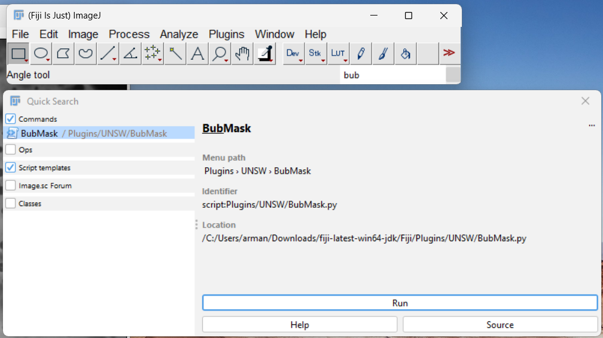

---

## 4. Main Settings

The first BubMask window is intentionally compact. Routine users normally only
need to confirm the detection method, model package, confidence threshold, and
calibration.

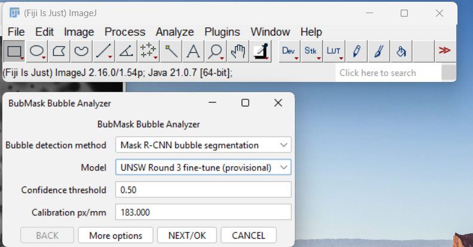

### Model Package

The prototype supports:

| Model | Purpose |
| --- | --- |
| Original BubMask | Baseline metadata only; original weights are not distributed in the public release |
| UNSW Round 2 | Current strongest held-out validation performance in this project |
| UNSW Round 3 | Current Fiji UI default and provisional fine-tune for side-by-side testing |

Important scientific note: Round 3 is installed for comparison, but the
held-out validation/test results showed Round 2 was stronger on the available
COCO masks. Do not claim Round 3 is more accurate without further validation.
The current interface still defaults to Round 3 because that is the workflow
used in the latest Fiji testing.

### Confidence Threshold

The confidence threshold controls which model detections are retained. A higher
threshold usually reduces false positives but may miss weaker bubbles. A lower
threshold usually finds more candidates but may include more incorrect masks.

### More Options

Advanced options are grouped under `MORE OPTIONS` so routine users do not need
to edit them. These settings include preprocessing profile, background
correction, quality gates, and preview behaviour. Use them only when testing a
specific image-processing condition.

### Main Buttons

| Button | What it does |
| --- | --- |
| `BACK` | Return to the previous step when available |
| `More options` | Expand advanced preprocessing and quality settings |
| `NEXT` or `NEXT/OK` | Continue to the next processing step |
| `OK` | Apply or refresh the current tab/settings |
| `CHANGE MODEL` | Return to model selection and rerun with another model |
| `FINISH PROCESSING` | Stop editing and move to final output-file selection |
| `CANCEL` | Cancel the current workflow |

---

## 5. Reviewing the Overlay

After inference, BubMask-Fiji opens review outputs showing:

- box overlay;
- mask overlay;
- bubble measurement table;
- histogram and statistics tabs;
- output file selection;
- run log.

The box overlay is useful for checking candidate locations. The mask overlay is
the most important scientific review image because it shows the segmented bubble
area used for measurement.

Green overlays indicate normal retained bubbles. Yellow overlays indicate
bubbles that need review or have quality warnings. All bubbles are treated as
ordinary bubbles in the final measurement table; manual bubbles are not reported
as a separate scientific class.

The review stage uses two windows: the image window is where Fiji ROIs are drawn,
and the BubMask review window is where the user adds ROIs, refreshes overlays,
checks tables, and moves to histogram/export.

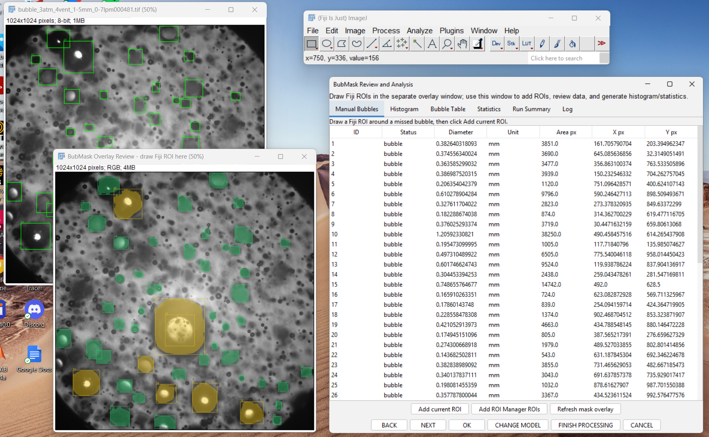

The usual navigation is:

1. Inspect the overlay image.
2. If masks are acceptable, press `NEXT` to move to histogram analysis.
3. If bubbles are missing, draw Fiji ROIs in the overlay image and add them in
   the Manual Bubbles tab.
4. Use `CHANGE MODEL` only if you want to rerun the image with another model.
5. Use `FINISH PROCESSING` only after manual correction and histogram settings
   are complete.

---

## 6. Adding Missed Bubbles Manually

If BubMask misses a bubble, add it using Fiji ROI tools:

1. In the review step, choose `ADD MANUAL BUBBLE`.
2. Use Fiji's ROI tools on the overlay review image.
3. Draw the bubble boundary or region of interest.
4. Return to the BubMask review window.
5. Press the button to add the current ROI or ROI Manager selections.
6. Press `REFRESH MASK OVERLAY` to update the displayed mask image.

The bubble table updates with the new bubble measurement. After addition, the
manual bubble contributes to the same histogram and statistics as all other
bubbles.

If a bubble was added incorrectly, use the delete/remove option in the manual
bubbles table, then refresh the overlay again.

The screenshot below shows five manually added bubbles. The image overlay has
been refreshed, and the measurement table has appended the new bubbles as normal
`bubble` rows.

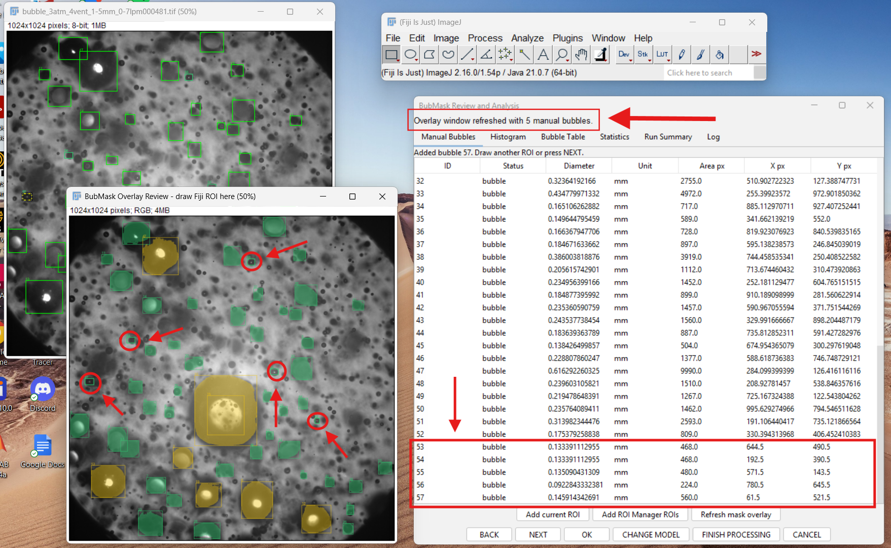

Video demonstration:

[Open the manual bubble workflow video.](figures/user_guide/manual_bubble_workflow.mp4)

In the video workflow, the user draws ROIs in the Fiji overlay image, adds the
current ROI or ROI Manager ROIs in the BubMask window, then refreshes the mask
overlay before continuing.

---

## 7. Histogram and Data Analysis

The histogram tab allows the user to inspect the bubble equivalent diameter
distribution before exporting results.

Available controls include:

- histogram by count;
- PDF display;
- CDF display;
- number of bins;
- x-axis minimum and maximum;
- Sauter mean diameter, reported as `D32` or `D[3,2]`;
- arithmetic mean diameter;
- graph and CSV filename prefix.

When changing histogram settings, press `OK` to refresh the graph. Use `BACK`
to return to manual bubble editing or model selection. Use `FINISH PROCESSING`
only when the masks, measurements, and histogram settings are ready for export.

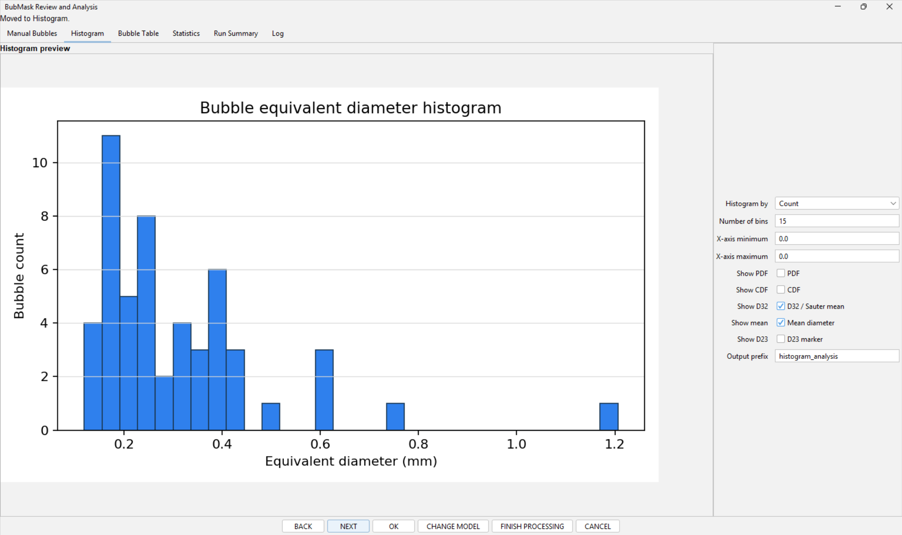

The histogram tab is interactive:

1. Choose what the y-axis represents using `Histogram by`.
2. Set the number of bins.
3. Enter x-axis limits if you want to zoom into a diameter range; leave limits
   at `0.0` to let BubMask choose automatically.
4. Toggle `PDF`, `CDF`, `D32 / Sauter mean`, `Mean diameter`, and `D23 marker`
   as needed.
5. Press `OK` to redraw the histogram with the new settings.

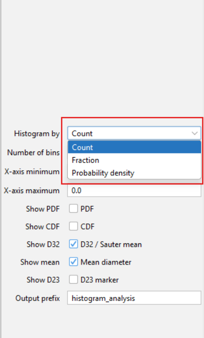

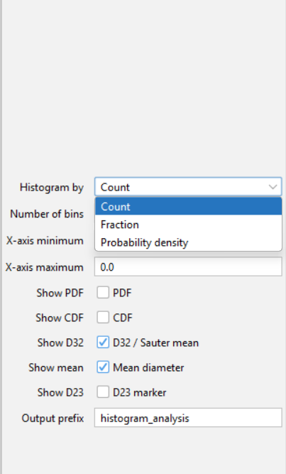

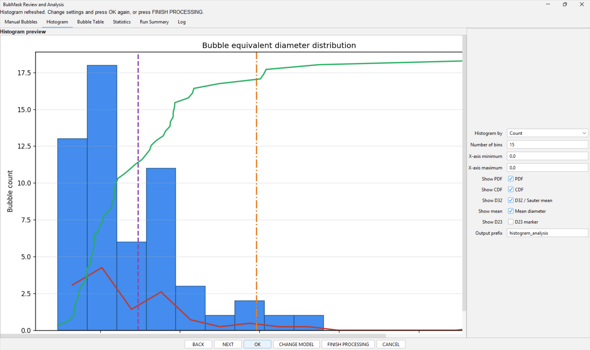

The `Statistics` tab provides numerical summary metrics such as count, mean,
median, percentiles, Sauter mean diameter, volume mean, minimum, and maximum.

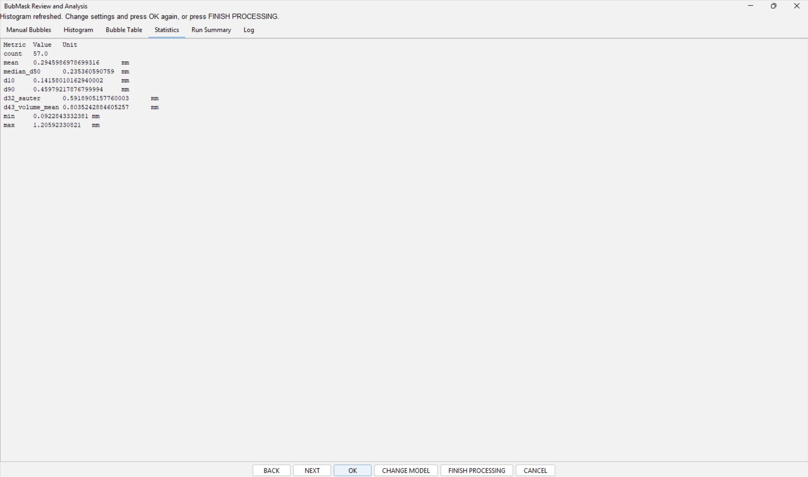

The `Run Summary` tab records the image, run folder, model, preprocessing,
calibration, worker status, and how many bubbles/manual bubbles were included.
Local paths shown in the screenshots are examples; on another computer they
will point to that user's Fiji and BubMask-Fiji folders.

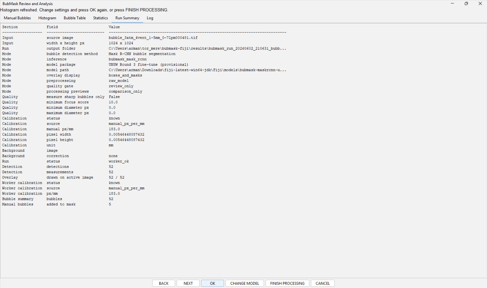

---

## 8. Exporting Results

After `FINISH PROCESSING`, BubMask-Fiji asks which files to keep. The simplified
scientific output package focuses on:

| Output | File type | Purpose |
| --- | --- | --- |
| Histogram | PNG and CSV | Reportable size-distribution graph and bin data |
| Bubble table | Excel-compatible table | Per-bubble area, equivalent diameter, position, score, and notes |
| Overlay pictures | PNG/TIFF | Visual audit of boxes and masks on the source image |
| Instance-label mask | TIFF | Pixel-level instance map for reproducibility and later review |
| Run summary/log | TXT or JSON | Model, calibration, settings, and export audit trail |

The user chooses the output folder. If the user chooses not to save outputs,
temporary files should be removed after the run.

After `FINISH PROCESSING`, BubMask asks whether to save the recommended output
package, choose individual files, or save no files.

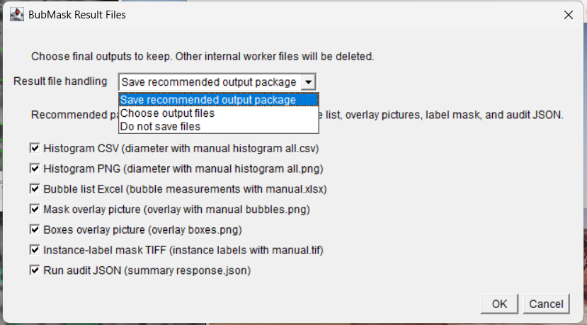

The final results window lists the retained files and their run-folder paths.

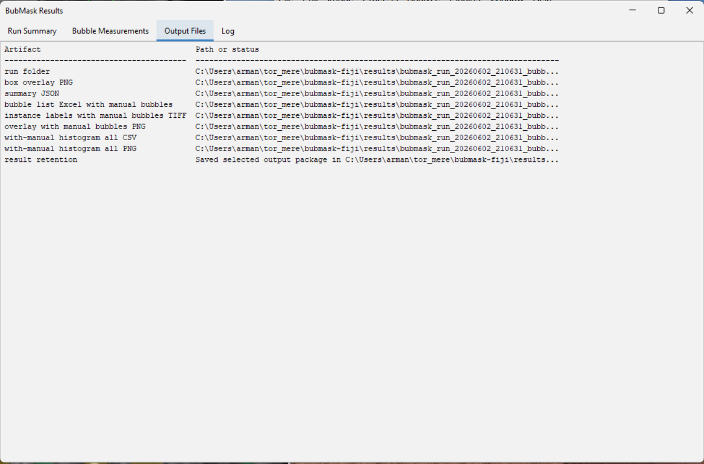

---

## 9. Scientific Interpretation

BubMask-Fiji should be reported as a segmentation-assisted measurement workflow,
not as a fully autonomous measurement instrument. The user must inspect overlays
and confirm calibration before using the results in a scientific analysis.

When reporting results, include:

- model package name;
- confidence threshold;
- calibration in px/mm;
- number of bubbles;
- histogram bin settings;
- whether manual correction was used;
- mean diameter and Sauter mean diameter;
- any image-quality limitations.

For mineral-processing experiments, summarize results by flow rate, pressure,
vent geometry, and replicate image when those metadata are available.

---

## 10. Troubleshooting

### BubMask does not appear in Fiji

Check that `BubMask.py` is installed in:

```text
Fiji/scripts/Plugins/UNSW/BubMask.py
```

Restart Fiji after copying the script.

### BubMask runs but no files are produced

Check the log tab and confirm that the Python worker environment is available.
Also confirm that the selected model package has the required local weights
file.

### The overlay looks wrong

Confirm that the correct model package and calibration were selected. If the
image has unusual illumination, try the advanced preprocessing options under
`MORE OPTIONS`.

### The histogram does not change

After changing bins, axis limits, PDF/CDF, or statistics overlays, press `OK`
inside the histogram tab to refresh the graph.

### Manual ROI bubbles do not appear

Make sure the ROI is active on the overlay review image or stored in Fiji's ROI
Manager, then press the manual-add button and refresh the mask overlay.

---

## 11. Current Prototype Limits

- Model weights are not committed to git because they are large binary files;
  UNSW Round 2 and Round 3 weights are distributed as release assets.
- Round 3 is provisional and should not be treated as the best scientific
  model.
- Inter-user repeatability of manual correction still needs formal testing.
- The current UI is a Fiji/Jython research prototype. A polished Java/SciJava
  production plugin remains future work.
- Overlapping-bubble reconstruction is intentionally not implemented in the
  current research objective.

---

## 12. Where to Read More

Primary technical report:

```text
docs/bubmask-fiji.md
```

Validation report:

```text
docs/reports/round3_heldout_validation_analysis_2026-05-29.md
```

UI feature report:

```text
docs/reports/ui_feature_explanation_report.md
```

JSON worker contract:

```text
docs/reference/json_contract.md
```
